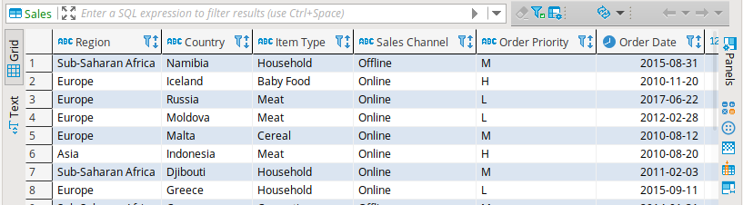

# Simple ETL with Python


## Description

In this project, we want to explore the fundamental of the data engineering by building the data pipeline using standard library that comes with Python. This pipeline are use to build the flows of the data from the sources to data scientist,analyst,consumer and etc.


## Objective

A company wants to analyse the sales records data, as engineer you have to get the data from data vendor and placed it into company’s database.
 
There are 50000 of sales record in csv file on sample dataset. We want this following to meet the objective:

1. Download sample dataset.
2. Extract zip file to local folder.
3. Inspect data source and start creating schema for our database.
4. Insert the files contain into database.
5. Verify the process .
6. Suppose you want to automate the task may consider scheduler software.


## Setting up


### Dataset


Use this dataset : [50000 Sales Records](http://eforexcel.com/wp/wp-content/uploads/2017/07/50000-Sales-Records.zip)


### Python


For Windows and Mac read [here](https://wiki.python.org/moin/BeginnersGuide/Download).

Most Linux OS has Python pre-installed, to check if your machine has python, run this command in terminal.

```
$ python3 --version
```

if not, run this command to install

```
$ sudo apt install python3
```

Please note that python version that we use to run this project’s scripts is 3.6.9.


### Mysql


In this project we using Mysql as our target database,but you can use any relational database you want like Postgres or sqlite.

For Mysql installation you can find it [here](https://dev.mysql.com/doc/refman/8.0/en/installing.html).

After you done installing python and mysql in your local machine install mysql-connector so you can run sql in python.

```
$ pip3 install mysql-connector-python
```

mysql-connector-python version that we use in this project is 8.0.22.


### Dbeaver (optional)


Install this Database Management software if you don’t want to use mysql’s terminal.


### Crontab (optional)


If you're on Linux machine ,crontab is useful program to automate our ETL task. [crontab](https://linuxhandbook.com/crontab/)


## ETL process


#### Extract

```classes/connection.py``` -> Established connection to database.

```classes/files.py``` -> Handling files by creating folder, download and uncompressed zip.

Before we load data to database we need to create table with a schema.

```DROP TABLE IF EXISTS Sales```

Our schema will be

```
CREATE TABLE Sales(
            Region varchar(256),
            Country varchar(256),
            `Item Type` varchar(20),
            `Sales Channel` varchar(20),
            `Order Priority` varchar(20),
            `Order Date` DATE NOT NULL,
            `Order ID` int(20) NOT NULL,
            `Ship Date` DATE NOT NULL,
            `Units Sold` int(20) NOT NULL,
            `Unit Price` int(20) NOT NULL,
            `Unit Cost` int(20) NOT NULL,
            `Total Revenue` int(20) NOT NULL,
            `Total Cost` int(20) NOT NULL,
            `Total Profit` int(20) NOT NULL
            )
```


#### Transform and load


```classes/data.py``` -> Parse csv file and load into database.


#### Verify


```classes/logging.py``` -> logs the process.


## How to use


Before we execute the program, open ```setup/config.json``` edit accordingly.

```
 "mysql": {
		"USER":mysql_username,
		"HOST":host_address,
		"DATABASE": names_of_database,
		"PASSWORD": mysql_password,
		"download_url":"http://eforexcel.com/wp/wp-content/uploads/2017/07/50000-Sales-Records.zip",
		"destination_folder":"/ETL Python/setup/data/"
        }
 ```

Run this file ```main.py```

Read ```logs.log``` to see status of our program.

Inspect database using DBeaver.





## Reference

[Mysql documentation](https://dev.mysql.com/doc/)

[Mysql connector/Python API](https://dev.mysql.com/doc/connector-python/en/connector-python-reference.html)

[Python Logging library](https://docs.python.org/3/library/logging.html)

[Python urllib library](https://docs.python.org/3/library/urllib.html)

[Easy ETL with Python: a step by step tutorial](https://medium.com/@mabresin/easy-etl-with-python-a-step-by-step-tutorial-794036d758de)

[crontab](https://linuxhandbook.com/crontab/)
